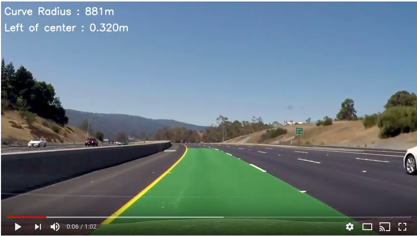

# Road Lane Detection

Udacity Self-driving car nano degree project 4, Advanced Lane Finding submission.

A video of the lane finding filter in action can be seen in the project 5 *Object detection and tracking* video below.

 [](https://youtu.be/8O_-bWPyUX8)

## Writeup

The [writeup.md](writeup.md) contains details of the code and mathematicle derivations used in this project.

---

## Prerequisites

This project requires python 3 and the following libraries installed

* OpenCv 3
* numpy
  * `pip3 install --user numpy`

## installation

Download and unzip or clone this repository onto your local machine with

```sh
$ git clone https://github.com/Heych88/udacity-sdcnd-advanced--lane-finding.git
```

## Run the Code

Navigate to the directory of the repository in terminal and run `main.py`.

```sh
$ cd <local directory?/udacity-sdcnd-advanced--lane-finding
$ python3 main.py
```

 The following image should appear.

[](output_images/test1.jpg)

## Contributing

1. Fork it!
2. Create your feature branch: `git checkout -b my-new-feature`
3. Commit your changes: `git commit -am 'Add some feature'`
4. Push to the branch: `git push origin my-new-feature`
5. Submit a pull request.

## License

This project is licensed under the MIT License - see the [LICENSE.md](LICENSE.md) file for details.
